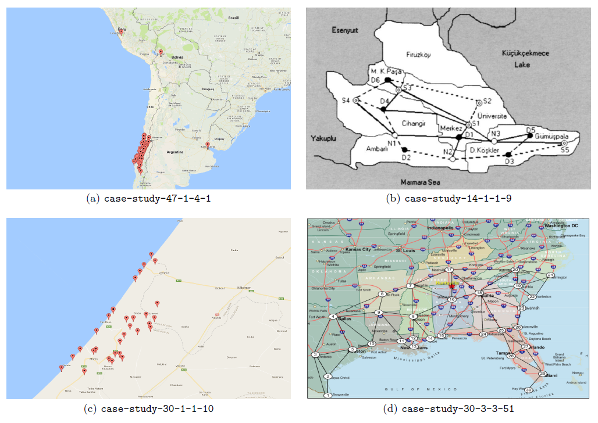
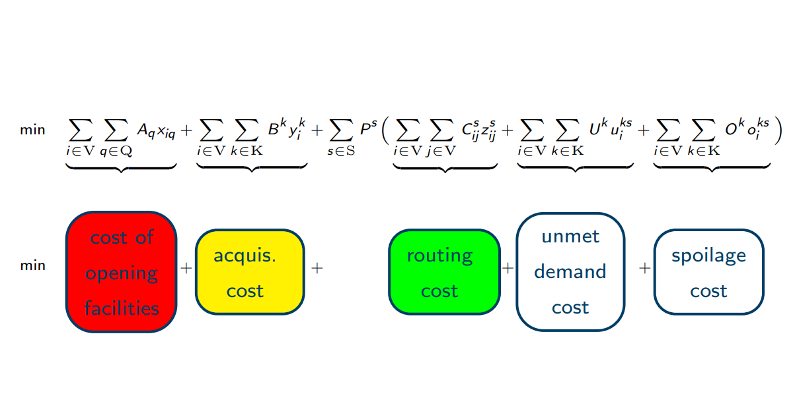

  

My main research interests lie in the domain of topological data analysis. In 2019 I joined the [Internet technology & Data science Lab (IDLab)](https://www.uantwerpen.be/en/research-groups/idlab/) at the Department of Mathematics & Computer Science, [University of Antwerp](https://www.uantwerpen.be/en/) - [imec](https://www.imec-int.com/en), with Professor [Steven Latré](https://www.uantwerpen.be/en/staff/steven-latre/) as my main supervisor. That same year I completed [my PhD](https://antor.uantwerpen.be/members/renata-turkes/) within the [University of Antwerp Operations Research (ANT/OR)](https://antor.uantwerpen.be/) group, under the supervision of Professor [Kenneth Sörensen](https://www.uantwerpen.be/en/staff/kenneth-sorensen/). I obtained a Msc in Pure Mathematics from [KU Leuven](https://www.kuleuven.be/english/), and a BSc in Mathematics from the [University of Tuzla](http://www.untz.ba/index.php?page=home), where I worked as a [teaching assistant](https://renataturkes.wixsite.com/renata-turkes) for a few years.

You can reach me at <renata.turkes@uantwerpen.be>, or find me on:
- [Google Scholar](https://scholar.google.com/citations?user=0qHk4EcAAAAJ&hl=en&oi=sra)
- [LinkedIn](https://www.linkedin.com/in/renata-turke%C5%A1-409a7863/?originalSubdomain=be)

## Research

<table style="width:100%">
  <tr>
    <td style="padding-left: 0px; cursor: pointer; vertical-align: top;"> 
       
    </td>
    <td> 
       
      <strong> Noise robustness of persistent homology on greyscale images, across filtrations and persistence signatures </strong>   
      Renata Turkeš, Jannes Nys, Tim Verdonck, Steven Latré    
      <i>(in preparation)</i>    
      <a href="https://github.com/renata-turkes/turkevs2021noise/">Code</a> | <a href="http://yann.lecun.com/exdb/mnist/">Data</a> 
    </td>
  </tr>  
  <tr>
    <td style="padding-left: 0px; cursor: pointer; vertical-align: top;"> 
       
    </td>
    <td> 
       
      <strong> A matheuristic for the stochastic facility location problem </strong>   
      Renata Turkeš, Kenneth Sörensen, Daniel Palhazi Cuervo    
      <i>Journal of Heuristics (2021)</i>    
      <a href="https://antor.uantwerpen.be/data-used-in-the-paper-a-matheuristic-for-the-pre-positioning-of-emergency-supplies/">Data</a> | <a href="https://antor.uantwerpen.be/wp-content/papercite-data/pdf/turkevs2018matheuristic_pres.pdf">Slides</a>
    </td>
  </tr>   
  <tr>
    <td style="padding-left: 0px; cursor: pointer; vertical-align: top;"> 
       
    </td>
    <td> 
       
      <a href="https://www.sciencedirect.com/science/article/pii/S037722172030936X?via%3Dihub"> <strong> Meta-analysis of metaheuristics: Quantifying the effect of adaptiveness in adaptive large neighborhood search </strong> </a>   
      Renata Turkeš, Kenneth Sörensen, Lars Magnus Hvattum    
      <i>European Journal of Operational Research (2020)</i>    
      <a href="https://www.sciencedirect.com/science/article/pii/S2352340920314505">Related <i>Data in Brief</i> publication</a> | <a href="https://data.mendeley.com/datasets/h4smx32r4t/3">Data</a> | <a href="https://antor.uantwerpen.be/wp-content/papercite-data/pdf/turkevs2019meta_pres.pdf">Slides</a> | <a href="https://antor.uantwerpen.be/meta-analysis-of-metaheuristics/">Blog</a></td>
  </tr>   
  <tr>
    <td style="padding-left: 0px; cursor: pointer; vertical-align: top;"> 
       
    </td>
    <td> 
       
      <a href="https://www.emerald.com/insight/content/doi/10.1108/JHLSCM-02-2018-0016/full/html"> <strong> Instances for the problem of pre-positioning emergency supplies </strong> </a>   
      Renata Turkeš, Kenneth Sörensen    
      <i>Journal of Humanitarian Logistics and Supply Chain Management, Vol. 9 No. 2, pp. 172-195 (2019)</i>    
      <a href="https://antor.uantwerpen.be/prepositioning-problem-instances/">Data</a> 
    </td>
  </tr> 
  <tr>
    <td style="padding-left: 0px; cursor: pointer; vertical-align: top;"> 
       
    </td>
    <td> 
       
      <a href="https://link.springer.com/article/10.1007%2Fs10479-017-2702-1"> <strong> Pre-positioning of emergency supplies: does putting a price on human life help to save lives? </strong> </a>   
      Renata Turkeš, Daniel Palhazi Cuervo, Kenneth Sörensen    
      <i>Annals of Operations Research 283, 865–895 (2019)</i>    
      <a href="https://antor.uantwerpen.be/data-used-in-the-paper-pre-positioning-of-emergency-supplies-does-putting-a-price-on-human-life-help-to-save-lives/">Data</a> | <a href="https://antor.uantwerpen.be/wp-content/papercite-data/pdf/turkevs2016pre_pres.pdf">Slides</a> | <a href="https://antor.uantwerpen.be/does-putting-a-price-on-human-life-help-to-save-lives/">Blog</a>
    </td>
  </tr>   
</table>
