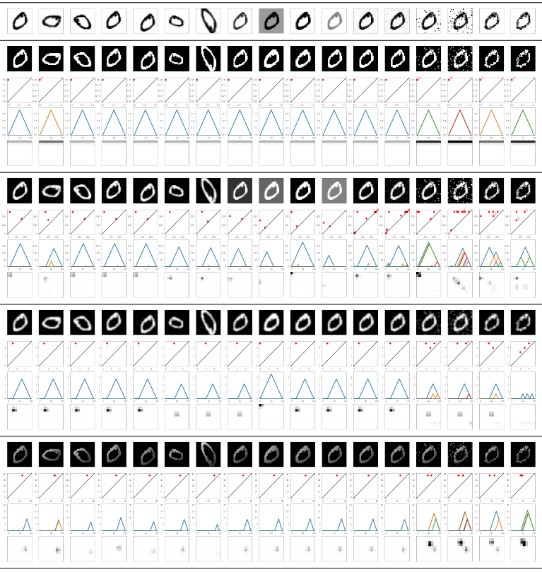

  

My main research interests lie in the domain of topological data analysis. In 2019 I joined the [Internet technology & Data science Lab (IDLab)](https://www.uantwerpen.be/en/research-groups/idlab/) at the Department of Mathematics & Computer Science, [University of Antwerp](https://www.uantwerpen.be/en/) - [imec](https://www.imec-int.com/en), with Professor [Steven Latré](https://www.uantwerpen.be/en/staff/steven-latre/) as my main supervisor. That same year I completed [my PhD](https://antor.uantwerpen.be/members/renata-turkes/) within the [University of Antwerp Operations Research (ANT/OR)](https://antor.uantwerpen.be/) group, under the supervision of Professor [Kenneth Sörensen](https://www.uantwerpen.be/en/staff/kenneth-sorensen/). I have a Msc in Pure Mathematics from [KU Leuven](https://www.kuleuven.be/english/), and a BSc in Mathematics from the [University of Tuzla](http://www.untz.ba/index.php?page=home), where I worked as a [teaching assistant](https://renataturkes.wixsite.com/renata-turkes) for a few years.

Find me on:
- [Google Scholar](https://scholar.google.com/citations?user=0qHk4EcAAAAJ&hl=en&oi=sra)
- [LinkedIn](https://www.linkedin.com/in/renata-turke%C5%A1-409a7863/?originalSubdomain=be)

## Research

|-|-|
|| Noise robustness of persistent homology on greyscale images, across filtrations and persistence signatures,           Renata Turkeš, Jannes Nys, Tim Verdonck, Steven Latré; [Code](https://github.com/renata-turkes/turkevs2021noise) - [Data](http://yann.lecun.com/exdb/mnist/)|
